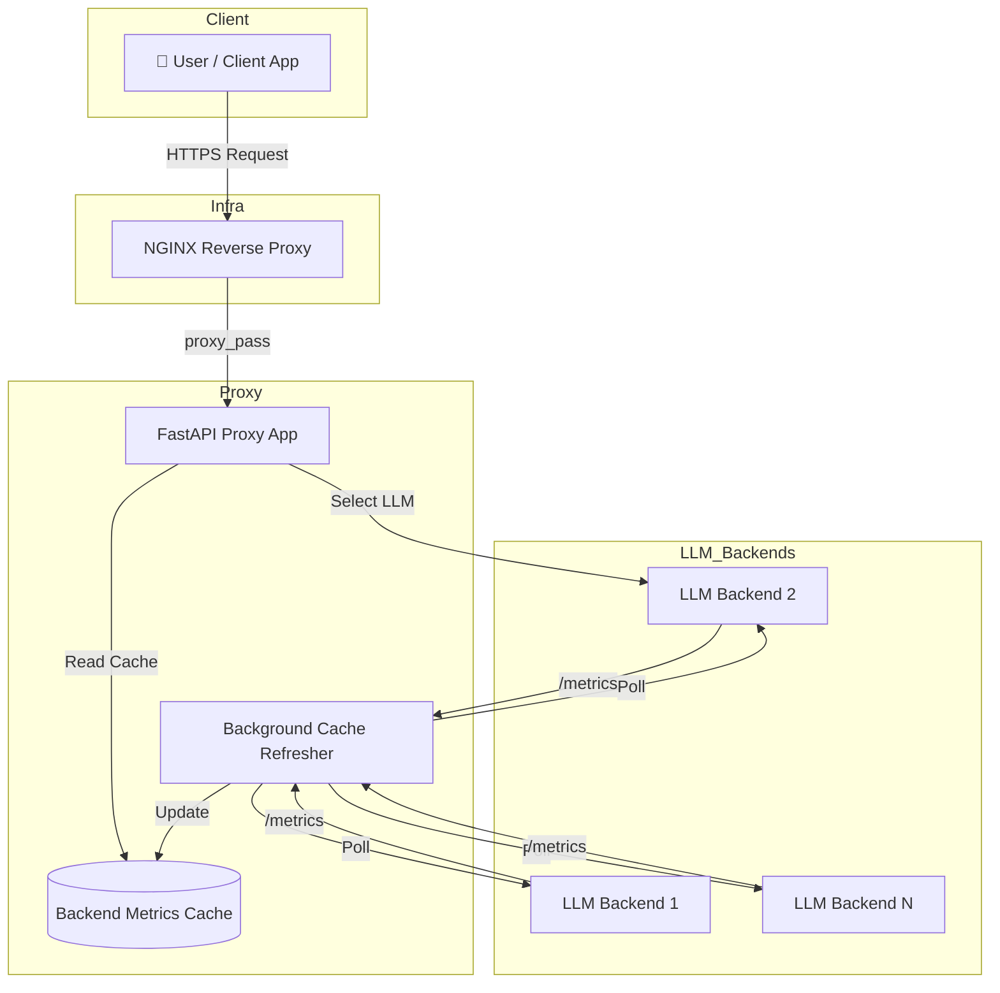

# Inference Engine Proxy Server

[](https://www.python.org/)
[](https://fastapi.tiangolo.com/)
[](https://www.docker.com/)
[](https://opensource.org/licenses/MIT)

一個針對 `llama.cpp` 和 `vLLM` 等大型語言模型（LLM）推論引擎設計的高效能、非同步反向代理伺服器。它提供了 **負載平衡**、**健康檢查** 和 **自動故障轉移** 功能，為多個後端 LLM 服務提供統一且穩定的單一入口。

-----

## 🚀 主要特色

  - **智慧負載平衡**：根據後端引擎的即時負載（如：正在處理的請求數）動態選擇最空閒的節點，確保資源充分利用。
  - **健康檢查與自動容錯**：定期檢查後端服務的健康狀態，自動從可用池中移除無回應或負載過高的節點，並在其恢復後自動納入。
  - **高效能非同步架構**：基於 `FastAPI` 和 `httpx`，所有 I/O 操作均為非同步，能以極低的延遲處理大量併發請求。
  - **背景快取刷新**：獨立的背景任務持續更新所有後端節點的狀態快取，讓負載平衡決策在主請求路徑上幾乎零延遲。

<!-- end list -->

  * **支援流式回應 (Streaming)**：完整支援 SSE (Server-Sent Events)，能夠代理 `chat/completions` 等流式 API，實現即時打字機效果。

<!-- end list -->

  - **後端無關設計**：透過抽象的 `BaseBackend` 類別，可以輕鬆擴充以支援其他推論引擎（如 TGI、Triton 等）。
  - **容器化部署**：提供完整的 `Dockerfile` 和 `docker-compose.yml`，一鍵啟動整個服務棧，包含代理、多個 LLM 實例和 NGINX。

-----

## 🏛️ 系統架構

此代理伺服器位於使用者和多個後端 LLM 推論服務之間。所有請求都先經過代理，由代理決定轉發到哪一個後端最為合適。



### 核心運作流程

1.  **背景狀態刷新**：

      - `cache_refresher.py` 中的一個 `asyncio` 背景任務會以固定間隔（例如每 3 秒）輪詢所有在 `.env` 中定義的後端服務。
      - 它會呼叫每個後端的 `/metrics` 和 `/health` 端點，獲取其**是否就緒 (ready)** 以及 **當前處理中的請求數 (requests\_processing)**。
      - 取得的狀態資訊（包含靜態的 `provider` 和動態的指標）被存儲在一個全域的記憶體快取 `_METRICS_CACHE` 中。

2.  **請求轉發與負載平衡**：

      - 當一個外部請求（例如 `/v1/chat/completions`）到達 `server.py` 的代理端點時。
      - `choose_backend()` 函式會**直接讀取記憶體快取**，而不是發起新的網路請求。
      - 它會篩選出所有「就緒」且快取未過期的後端。
      - 在這些候選者中，它會找出「處理中請求數」最少的後端。如果有多個後端負載相同，則從中隨機選擇一個，以實現更均勻的負載分佈。
      - 最後，請求會被非同步地轉發到被選中的後端服務，並將後端的回應（無論是標準 JSON 還是流式 SSE）回傳給原始客戶端。

-----

## 📂 專案結構

```
.
├── docker-compose.llamacpp.yml # Docker Compose 設定檔
├── Dockerfile                  # 代理伺服器的 Dockerfile
├── .env.example                # 環境變數範例
├── nginx/
│   └── nginx.conf              # NGINX 設定檔
├── requirements.txt            # Python 依賴
├── scripts/
│   └── run.sh                  # 服務啟動腳本
└── src/
    └── inference_engine_proxy_server/
        ├── server.py           # FastAPI 主應用、路由定義
        ├── backends/           # 後端引擎的抽象與實作
        │   ├── base.py         # 基礎後端抽象類別
        │   ├── llamacpp.py     # llama.cpp 後端實作
        │   └── vllm.py         # vLLM 後端實作 (待完成)
        ├── core/               # 核心邏輯
        │   ├── cache_refresher.py # 背景快取刷新器
        │   ├── constants.py    # 常數、環境變數載入、快取結構
        │   ├── functions.py    # 核心功能函式 (如: choose_backend)
        │   └── http_client.py  # 全域 httpx 客戶端管理
        └── utils/
            └── utils.py        # 通用工具函式
```

-----

## 🛠️ 如何開始

### 前置需求

  - [Docker](https://www.docker.com/products/docker-desktop/)
  - [Docker Compose](https://docs.docker.com/compose/install/)
  - NVIDIA GPU 及對應的 [NVIDIA Container Toolkit](https://docs.nvidia.com/datacenter/cloud-native/container-toolkit/latest/install-guide.html)

### 1\. 環境設定

首先，複製 `.env.example` 並將其命名為 `.env`。

```bash
cp .env.example .env
```

然後，根據您的環境修改 `.env` 檔案。

```env
# 外部訪問的 Port
PORT=8888

# LLM 模型檔案存放路徑和檔名
MODEL_DIR=/path/to/your/models
MODEL=your_model.gguf

# 設定後端 LLM 服務的 URL (必須對應 docker-compose.yml 中的服務名稱)
# 使用逗號分隔，且不要有空格
BACKENDS=http://llm-1:8080,http://llm-2:8080

# 背景快取刷新間隔（秒）
METRICS_CACHE_TTL_SECONDS=3

# 請求轉發到後端的超時時間（秒）
BACKEND_TIMEOUT_SECONDS=300

# llama.cpp 後端健康檢查的閾值
# 當處理中請求數超過此值，節點將被視為不健康
MAX_ALLOWED_REQUEST_QUEUE=6
# 當延遲請求數超過此值，節點將被視為不健康
MAX_ALLOWED_DEFERRED=3
```

### 2\. 啟動服務

使用 `docker-compose` 一鍵啟動所有服務（包含兩個 `llama.cpp` 後端、代理伺服器和 NGINX）。

```bash
docker-compose -f docker-compose.llamacpp.yml up -d --build
```

服務啟動後，`docker-compose` 會根據 `depends_on` 的 `service_healthy` 條件，確保在 `proxy` 啟動前，後端的 `llm-1` 和 `llm-2` 都已經處於健康狀態。

### 3\. 驗證服務

#### 檢查代理健康狀態

您可以向代理的 `/health` 端點發送請求來查看其狀態和可用後端的列表。

```bash
curl http://localhost:8888/health | python -m json.tool
```

您應該會看到類似以下的輸出：

```json
{
    "status": "ok",
    "available_backends": [
        "http://llm-1:8080",
        "http://llm-2:8080"
    ],
    "total_backends": 2,
    "timestamp": 1723306898.12345,
    "details": [
        {
            "backend": "http://llm-1:8080",
            "ready": true,
            "metrics": {
                "timestamp": 1723306897.54321,
                "requests_processing": 0.0,
                "ready": true
            }
        },
        {
            "backend": "http://llm-2:8080",
            "ready": true,
            "metrics": {
                "timestamp": 1723306897.54321,
                "requests_processing": 0.0,
                "ready": true
            }
        }
    ]
}
```

#### 發送推論請求

現在，您可以像對單一 OpenAI 相容 API 發送請求一樣，與代理伺服器互動。代理會自動將請求轉發到負載最低的後端。

```bash
curl http://localhost:8888/v1/chat/completions \
  -H "Content-Type: application/json" \
  -d '{
    "model": "your_model.gguf",
    "messages": [
      {
        "role": "user",
        "content": "你好，請介紹一下你自己"
      }
    ],
    "stream": false
  }'
```

若要測試流式回應，只需將 `"stream": true` 即可。

-----

## 📚 API 端點

  - `GET /health`：提供代理伺服器及其所有後端的健康狀態。這是一個基於快取的高速查詢，不會對後端造成額外負擔。
  - `ANY /{full_path:path}`：主要的代理端點。它會捕獲所有路徑和 HTTP 方法，並將其轉發到最適當的後端。例如 `POST /v1/chat/completions` 或 `GET /v1/models`。
  - `GET /docs`：提供互動式的 Swagger UI API 文件。
  - `GET /redoc`：提供 ReDoc 風格的 API 文件。
  - `GET /`：歡迎頁面。

-----

## 🔧 客製化與擴充

### 新增更多後端實例

1.  在 `docker-compose.llamacpp.yml` 中，複製 `llm-2` 服務並將其命名為 `llm-3`。
2.  在 `.env` 檔案的 `BACKENDS` 變數中，新增 `http://llm-3:8080`。
3.  重新啟動服務 `docker-compose -f docker-compose.llamacpp.yml up -d --build`。代理會自動偵測並納入新的後端。

### 支援新的推論引擎

本專案的設計使其易於擴充。若要支援一個新的推論引擎（例如 `MyNewEngine`）：

1.  在 `src/inference_engine_proxy_server/backends/` 目錄下，建立一個新檔案 `mynewengine.py`。
2.  在該檔案中，建立一個繼承自 `BaseBackend` 的新類別 `MyNewEngineBackend`。
3.  實作 `fetch_metrics(self) -> Tuple[float, bool]` 方法。此方法需要從 `MyNewEngine` 的某個端點（例如 `/metrics` 或 `/status`）獲取其**當前負載**和**就緒狀態**。
4.  更新 `src/inference_engine_proxy_server/core/functions.py` 中的工廠函式，讓它能夠根據後端的 `provider` 資訊（通常從 `/v1/models` 的 `owned_by` 欄位獲取）來實例化您新的 `MyNewEngineBackend`。
5.  更新 `cache_refresher.py` 以處理新的 `provider` 類型。

-----

## 📜 授權

本專案採用 [MIT License](https://www.google.com/search?q=LICENSE) 授權。